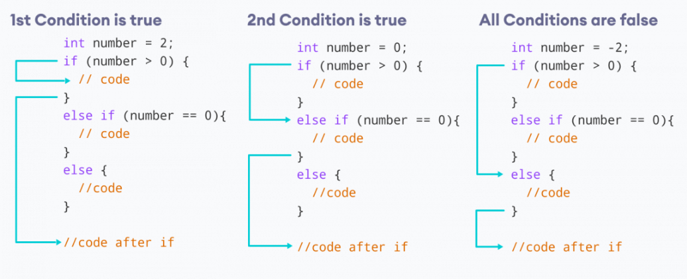

# Lab Assignment 07

In this lab you will practice working with decision making statements.

Same as the previous labs, you need to set up your workspace (class and main() method).

## Let's get started!

First, let's look at the name of our .java file in the `src/` directory and name your class accordingly and remember to make it `public`. Next, **create your main() method inside your class**.

Now let's begin!

### Decision Making Statements

Exactly the same as C++. But let's refresh anyways. 

Java has the same decision making statements as C++: `if`, `else`, `else if`, and `switch`.



For more information on decision making in Java visit: https://www.w3schools.com/java/java_conditions.asp  and https://www.w3schools.com/java/java_switch.asp

## Your Assignment

### Decision Making Statement Practice

For this lab assignment I want you to practice working with decision making if/else statements. 

Create the corresponding decision making statement to output the appropriate message.

Copy the code snippet below and paste it inside your **main() method** in your java file.

```java
// Problem 1. If the value inside num is even output "Even", otherwise output "Odd".
int num = 77;
/* Write your DM statement here. */

// Problem 2. If the value inside car_speed is greater than 70 output "Speeding", otherwise output "Not Speeding".
float car_speed = 82.5f;
/* Write your DM statement here. */

// Problem 3. If the value inside grade is greater than 90 output "Excellent",
//            otherwise if the value inside grade is greater than 70 output "Good Job", otherwise output "Failed".
double grade = 89.9999;
/* Write your DM statement here. */

// Problem 4. If the first character in word is capitalized output "Uppercase",
//            otherwise if the first letter is not capitalized output "Lowercase", otherwise output "Non Alphabet".
String word = "Hello There";
/* Write your DM statement here. */

// Problem 5. (**User the Ternary Operation here**) If the value inside temp is greater than or equal to 90 assign "Hot" to weather,
//            otherwise assign "Cool" to weather.
float temp = 77.2f;
String weather; /* Write your ternary operation here. */
System.out.println( weather );

/*
Expected Output:
Odd
Speeding
Good Job
Uppercase
Cool
*/
```

## Submit your assignment

[Grading Criteria](https://joselitoguardado.dev/3326/labs/Lab_07.pdf)

[How to Submit Assignments to GitHub](https://joselitoguardado.dev/3326/How_to_Submit_Assignments_to_GitHub.pdf)
